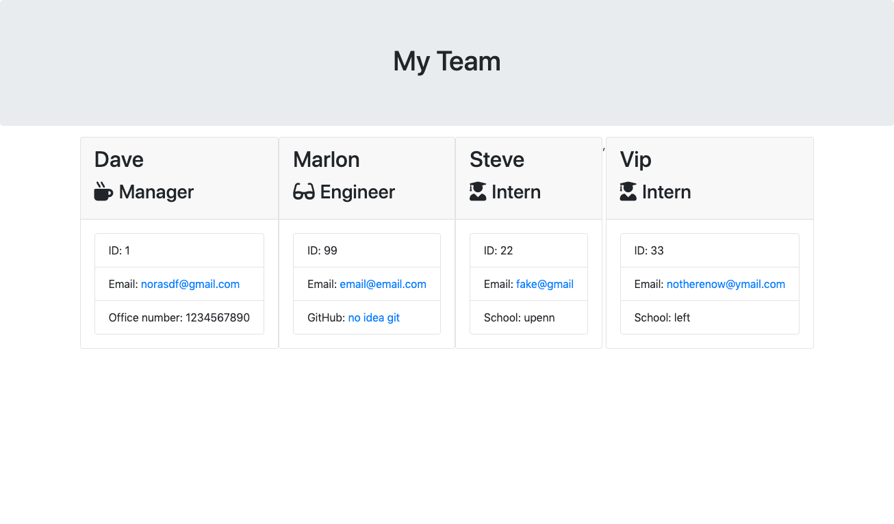

# employee_list

app.js is the working file that should be used in the command prompt.

A roster building tool using CLI. Using the command line the user is able to build a team and have all the information saved and then rendered in an easily readable file. The prompts given allow the user to determine how many team members there will be and what role each member of the team have. Depending on the role selected there will be different information asked/provided.

Used Jest to test the application.

video of application working:

https://drive.google.com/file/d/1kWU4X76z2MLljDzKMyVKh60EmWZ3gAsL/preview"
